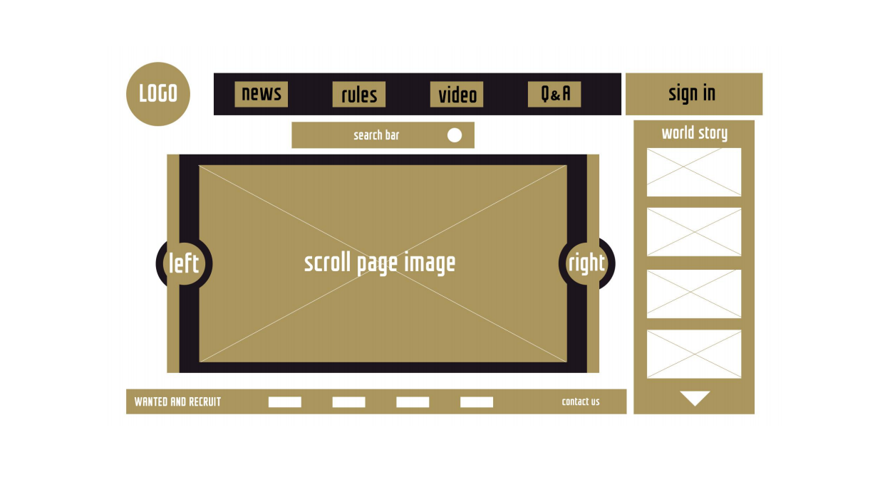
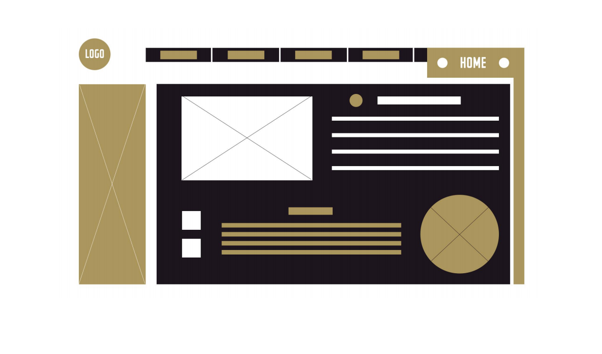
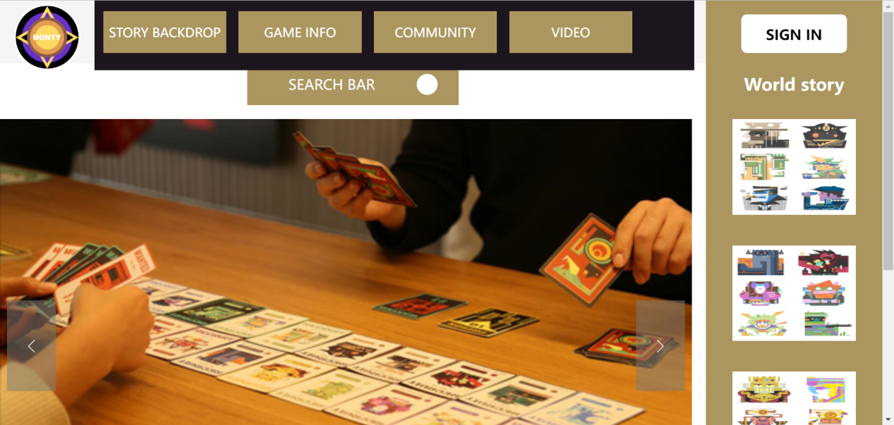
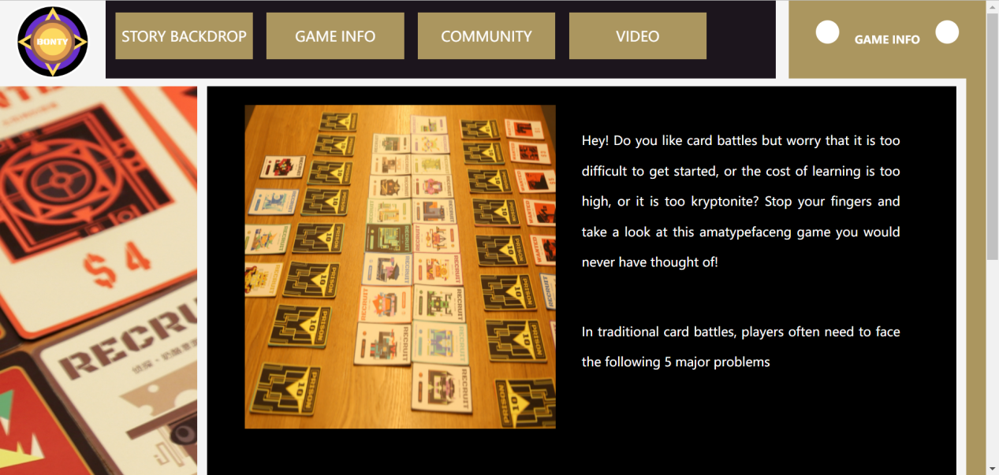

## Reflect
Welcome to my bounty hunter website, which is a site that introduces my original board game, where all the footage is drawn, filmed and recorded by myself. In the overall page layout, I used a static layout. It is worth mentioning that because the content has not yet been released, I tried to simulate the form of a private website, so this website is designed to enter a password to enter. Secretly tell you that the account name is 123 and the password is 456. Of course, in order to make it easier to view the job, you can still click in without entering the password. The upper-right corner of the page always shows the page you're working on now.

After logging in successfully, you will go to the home page of the website, and the color of the page will be selected, because considering that this is a product introduction website, I do not want too many decorative elements to interfere with the viewer's eyes. So I used black and white, brown and yellow three main colors. This doesn't make the page look too cluttered, and at the same time has more of an atmosphere for product introductions.

On the main page, there is a clickable scroll bar, you can click on the previous or next to switch the image information, 1 there are 5 pictures about the theme of the board game.

In the footer section, all the copyright holders were myself, so I filled in my own information.
On the right side of the page, there is a world story about cards, which is not yet open, and is only displayed as a picture.

The navigation bar is divided into 4 categories, namely story background, game information, community, and video. All the text messages are also written by myself.

In the sidebar, I placed pictures to enrich the visuals of the site.

At any time, the right side can display the title of the web content you are browsing, and the left side is the HOME button, which is also my own design logo graphic, which allows you to quickly return to the home page. With each click, you're experiencing the process of the bounty hunter returning to the main city to collect the bounty in this card game.

In the video interface, you can see the introductory video of this board game, which is also recorded and edited by myself.

This site is a board game-oriented website that is written using basic html, css, and native js. The general idea is to design a rough sketch yourself, and then look for some material and video that meets the criteria, as well as related text. When writing the page, the positioning of the home page is the login login condition, only the user name and password can be entered correctly to enter the page normally, otherwise it will be "rejected"! The site is divided into six pages, namely: login, home page, story background, game materials, community interaction, video module. The content of each page is very different. I used div a lot to layout, for the width of the box I did not give px as a unit, but directly gave % to do the unit, so that it is very convenient to calculate the accurate value between the width of the box. The width of each box is controlled within 100%. The parent box is wrapped around the child box, so that the layers are folded, which has a good composition effect on the page. On the site color collocation, I did not use too many color collocations, and there are only three colors overall: brownish yellow, black and white. This makes the whole page look less fancy. I also use a lot of floating knowledge, floating left float right with % to use it is very collocation.

## low-fidelity sketch：Home page

## Low-Fidelity Sketches: Content Pages

## Final home page display：

## Final content page display：

